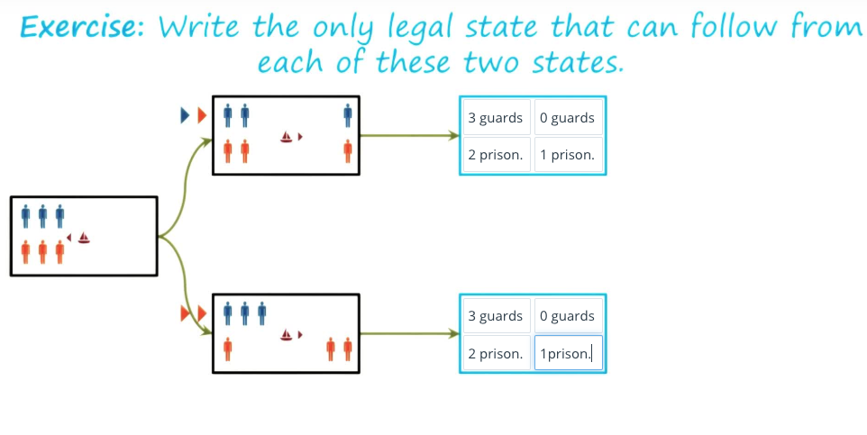
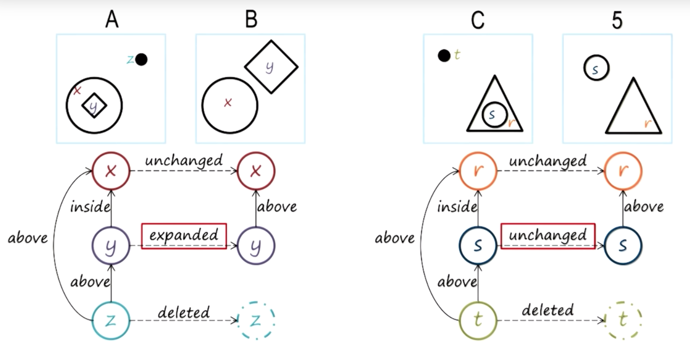
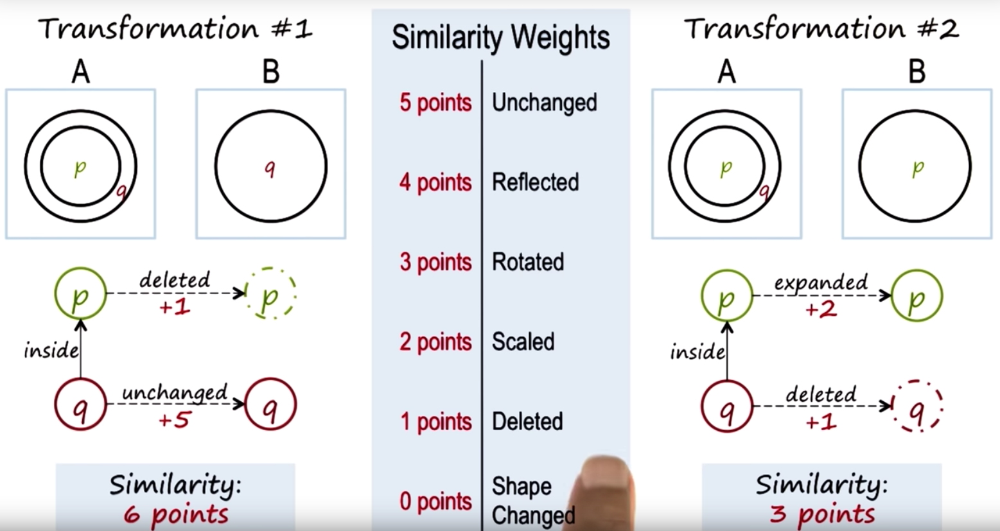

# Lesson 1

## Lesson 1:02 - Preview

- We'll talk about conundrums and characteristics of AI
- KBAI, and the 4 schools of AI
- Cognitive systems
- Topics in AI

## 1:03 Conundrums

1. Intelligrent agents have limited computational resources (memory, computational speed), but most interesting AI problems are computationally intractable. How, then, do we get AI agents to give us real-time/near real-time performance on interesting problems?

2. All competition is local, but most AI problems have global constraints. How can we get AI agents to addrss global problems using local computation?

3. Logic is deductive, but many problems are not — they're inductive or abductive (??). How do we get AI agents (AIA) to address these?

4. The world is dynamic and knowledge is limited. An AIA always begins with what it already knows. So how can an AIA address a novel problem?

5. Problem solving, reasoning, and learning are hard. But explanation and justification are even harder — so how do we get AIAs to explain and justify their decisions?

## Characteristics of AI problems

1. knowledge/data often arrives incrementally
2. problems exhibit recurring patterns
3. problems have multiple levels of granularity/abstraction
4. Many problems are computationally intractable. 
5. The world is dynamic, but *knowledge* of the world is static
6. The world is open-ended, but *knowledge* of it is limited.

How do we design AIAs that address AI problems with these characteristics?

## AIA characteristics

1. AIAs have limited computing power
2. AIAs have limited sensors (can't detect everything)
3. AIAs have limitefd attention
4. Computational logic is fundamentally deductive
5. AIA's knowledge is incomplete relative to the world

How can AIAs that are so limited address open-ended problems?

## Jeopardy quiz

Watson must:

1. Understand text
2. Search through knowledge base
3. decide on answer
4. phrase answer in form of a question

## What is Knowlege-based AI?
1. Reasoning
2. Learning (Watson is learning that an answer is right/wrong )
3. Memory (Watson stores this, using it in later reasoning processes)

All these are interconnected, and are called *deliberation*.

We have input in the form of perceptions of the world, and output in the form of actions on the world. The agent architecture also includes *metacognition* and *reaction*.

## Foundations: The four schools of AI

On one end of the spectrum is *acting*. On the other is *thinking*. When you're driving a car, you're acting on the world. When you're considering the route to take, you're thinking. 

On the other dimension, we've got AIA that are *optimal*, vs. AIAs that are *like humans*. Humans are multifunctional and have a robust intelligence that works for a large number of tasks, while on the other end of the spectrum we have AIAs that are specialized for a certain number of tasks and are configured completely and exclusively for peak performance on those tasks.

Thus, we have 4 quadrants:

1. AIAs that think optimally (e.g., machine learning)
2. AIAs that think like humans (e.g., semantic web, which understand information on the web)
3. AIAs that act optimally (e.g., airplane autopilot)
4. AIAs that act like humans (e.g., improvisational robots)

In KBAI, we're interested in quadrant 2.

## Quiz: where do autonomous vehicles end up on this quadrant?

We'd say we want it to be optimally acting and thinking.

## Quiz with robots:

Here is where certain robots fall:

- Google maps thinks optimally
- Roombas act and move around optimally
- C3P0 acts humanly
- Siri thinks like humans

## What are congitive systems?

Cognitive refers to dealing with human-like intelligence.

Systems refers to having multiple interacting components (e.g., learning, reasoning, memory).

Thus, we're dealing with systems that exhibit human-like intelligence through the multiple interacting components above.

## Cognitive system architecture, aka KBAI agents

The cognitive system is situated in the physical world. This world has perceptions of things: something is smooth, or pink, or big. 

The cognitive system users sensors to perceive this. This is the input used in the cognitive system. The cognitive system also has some actuators (e.g., fingers) to carry out actions in the world. 

The cognitive system uses percepts (things perceived) as inputs, and actuators' actions as outputs. One can have multiple cognitive systems that can interact with each other — cognitive systems aren't just situated in a physical world, but in a social world too.

What is the architecture of a cognitive system? How do percepts map onto actions? Well, we can map things directly onto actions: imagine driving a car, and the brake lights turn red. You would then push on your own brake pedal. This is an example of a *reactive system*.

Now let's consider that you're driving on the highway. Your task is to change lanes; you look around, and then take an action that will help you change lanes. You will likely not just *react*, but also *deliberate*. As we discussed, deliberation has 3 interwoven components: reasoning, learning, and memory. 

Now let's consider the changing lane example again. As you change lanes to the left, someone honks, because you didn't give someone enough space. This indicates to you that your deliberation and reaction processes didn't go smoothly — you are now in the realm of reasoning ABOUT your deliberation and reaction. That is to say, we're now dealing with *metacognition*, as well as *deliberation* and *reaction*, which allows you to change your reactions and deliberations in the future.

Intelligence, here, is about mapping percepts to actions in the world.

This is called the three-layered architecture.

## Topics in KBAI

1. Fundamentals
a. semantic networks
i. production systems
ii. generate and test
    1. means-end analysis
    2. problem reduction

2. Planning
a. logic
b. planning

3. Common sense reasoning
a. frames
b. understanding
c. common sense reasoning
d. scripts

4. Analogical reasoning
a. learning by recording cases
b. case-based reasoning
c. explanation based learning
d. analogical reasoning

5. Metacognition
a. learning by correcting mistakes
b. meta-reasoning
c. ethics in AI

6. Design + creativity
a. configuration
b. diagnosis
c. design
d. creativity

7. Visuospatial reasoning
a. constraint propagation
b. visuospatial reasoning

8. Learning
a. learning by recording cases
b. incremental concept learning
i. classification
ii. version spaces

# Lesson 2

## Preview

1. Learning goals, outcomes, and strategies of class
2. Projects and assessments
3. Computational psychometrics
4. Raven's progressive matrices outline
5. Principles of CS7637

## Class goals

1. Core methods of knowledge-based AI
- structured knowledge representation
- memory organization
- reasoning
- learning
- cognitive architecture
- meta reasoning

2. Tasks addressed by KBAI
- classification 
- understanding
- planniing
- explanation
- diagnosis
- design

3. Learn ways how AIAs use these methods to address these tasks

4. Relationship between AI and human cognition

## Learning outcomes

1. Design, implement, and describe KBAIAs
2. Use these strategies to address complex, practical problems
3. Use design of AIAs to reflect human cognition

## Class learning strategies

1. Learning by example (see an example)
2. Learning by doing (use this example)
3. Project-based learning
4. Personalization
5. Learning by reflection

## Intro to computational psychometrics

Psychometrics refers to the study of human intelligence, aptitude, knowledge.

The *computational version* of this refers to creating AIAs that can take the same tests that humans do when tested for intelligence, aptitude, or knowledge.

We occasionally compare errors and performance of an AIA to those of humans, we know they are similar to humans on the tests involved. 

## Raven's progressive matrices

This is a test created in the 1930s to exaxmine general intelligence, and consists of 60 multiple-choice visual analogy problems. 

It's unique, in that its exclusively visual.

It's the most widespread, common, and reliable test of intelligence,

The test has 2 problems: 2x2 matrix problems, and 3x3 matrix problems. 

We'll also look at a 2x1 matrix for the sake of the class, although they're not in the original test.

## Quizes

- sometimes we're used to an approach to solving these; when our expected answers to the test aren't available, we're forced to *generate and test* novel strategies to solve the matrices.

- sometimes questions have 2 answers. How do we know which one humans usually pick? How do we get an AIA to pick the same one as the humans?

- Note that for 2x2 matrices, the relationship between the top row and bottom row is important, as well as the relationship between the left column and the right column, too! Diagonal relationships are also possible. 

- For 3x3 rows, we can also imagine them rotating! Remember than an AIA needs to control for the *presence* of items, too!

- Sometimes a relatinoship between the first 2 columns or rows dictates the outcome of the third column; same with rows. For example, an *exclusive or* relationship dictates what's visible in the third column. The *order* of these cells becomes important! 

- You can also substitute one of the 6 answers for the final answer and test whether it makes sense.

- Note how we REASON through these matrices: we generate solutions based on previously available rules, match them to possible outcomes, and if none exist, we must devise new ones based on the circumstances.

## What is intelligence?

In KBAI, we posit that *knowledge* takes central position in *human level intelligence*.

## Principles of CS7637

1. KBAIAs use knowledge to guide reasoning; they *represent* and *organize* this knowledge in *knowledge structures*

2. Learning is often incremental. This links back to a previously discussed idea: data and experience come in *increments*.

3. Reasoning is top-down, not just bottom up! We don't just reason, we use data to aid reasoning and help us act correctly in circumstances that we've never seen.

4. KBAIAs match methods to tasks, and may even integrate methods to address complex tasks.

5. KBAIAs use heuristics to find solutions that are good enough, though not necessarily optimal. This is because there's a tradeoff between computational efficiency and the optimal-ness of solutions. Our focus will be on bounded rationality, and within these constraints, producing near real-time performance on computationally intractable problems. 

6. KBAIAs use recurring patterns in the problems they solve.

7. Reasoning, learning, and memory constrain and support each other. We'll build theories that aren't just theories of reasoning or learning or memory, but ones that *unify* all three into a cognitive system.

## Cognitive Connection 

We're trying to build AIAs that can take the same tests that we can. This provides opportunities to look at human cognition. If the AIAs make the same mistakes that we do, they're human-like in their reasoning!

Side-note: individuals with autism perform just as well on Raven's matrices perform as well as neurotypical individuals.

# Lesson 3 - Semantic networks

## Preview

1. knowlege representations
2. semantic networks
3. Problem-solving with semantic networks (2x1 matrix problems)
4. The represent and reason modality: 
- represent the knowledge
- represent the problem
- use that knowlege to address the problem

We'll wrap this lesson by connecting this topic with human cognition.

## Knowledge representations (KR)
What are these?

1. In each KR, there is a *language*. That language has a vocabulary. 
2. In addition, each KR has *content* — some knowledge.

e.g., consider Newton's second law of motion:

F = ma

This is a simple KR, where there is 

i. a language of algebraic equations
ii. the content of our knowledge of Newton's second law of motion

## Intro to semantic networks

How do we build semantic networks that represent the sorts of Raven's matrices we saw earlier?

Let's say each object in a standard image:

circle, hollow - represented by *x*
diamond, hollow - represented by *y*
circle, filled - represented by *z*

We also want to represent the relationships between these objects. How do we do so? Using *links* between these objects.

Each of these links can be labelled. e.g.,:

y to x link: "inside" x
z to y link: "above" y
z to x link: "above" x

In this case we are creating a semantic network representation of 2-d space. 

How do we capture the relationship between images A and B? i.e., how do we capture the transformation from A to B?

We'll start building links between the objects in A and objects in B.

This is straight forward for X and Y, but what about Z? We can have a dummy node instead of it. 

The link between the Ys indicated that Y expanded from A to B, and the relationship between the Xs indicates that it was unchanged.

This semantic knowledge representation boils down to:

1. objects in A and objects in B
2. *relationships* between objects in A and *relationship* between objects in B
3. *relationships* between objects in A and objects in B 

Here's another example:

*NB: when we characterize changes between 1 image and another, remember that according to the rules we've put down, the *location* of an object relative to other objects is characterized by #2, and the change in the object's size or state is characterized by #3.*
## Structure of semantic networks

We've just looked at several semantic networks. Let's characterize a semantic network as a KR:

1. A KR has a *lexicon*, which tells us about the vocabulary of the representation language.
2. A KR has a *structure* (i.e., how the lexicon parts interact), which tells us how the words in the vocabulary can be composed into complex representations.
3. A KR has *semantics*, which tells us how the representation allows us to draw inferences so that we can reason. 

Let's think of this in the context of our Raven's matrices:

1 - Lexicon: nodes capture objects
2 - Structure: this is provided using directional links
3 - Semantics: we put labels on links which allows us to draw inferences about reasoning with this representation. 

## Characteristics of good knowledge representations

1. A good KR makes relationships specific
2. Expose natural constraint
3. Brings objects and relations together (appropriate level of abstraction)
4. Removes details that aren't needed (appropriate level of abstraction)

TL;DR - it's transparent, concise, complete, fast, computable.

## Discussion, good representations

What's a good representation in everyday life?

- lecture example: nutritional information listed on the back of food containers.

Is it concise? No, because it lists all information that anyone perusing the item may want to see.

Does this make relationships explicit? No, it doesn't. We don't know the number of calories from fat, for example, even though there are more calories per gram of fat than, say, protein.

Consequently, we'd say that nutritional labels capture *some* of the information that allows us to make good inferences, but far from all of it.

## Guards and prisoners problem/cannibals and missionaries problem

This is an old problem used by AI researchers when discussing problem representation. 

There are 3 guards and 3 prisoners; prisoners may never outnumber guards, and prisoners must be transported to other side of river. How do we do this?

## Semantic networks for guards and prisoners

- Each node is a state in the problem (each node is a snapshot of a scenario).

In this state, one prisoner and one guard are on one side. 

Now let's add the structural part — that's the transformations. It connects the various nodes/scenarios into a more complex "sentence."

Here's an example:

In the first node, two prisoners and two guards are on the right side. The boat can move people from this side to the left side. The structural part of this semantic network indicates that a prisoner and guard move by boat to the left side. In the linked node, we then see that the boat is on the left side, which now has two prisoners and two guards. 

In this representation, icons represent objects and the labels on the links between nodes.

## Solving guards/prisoners problem 

If we have the right KR, this should make problem solving easier. Let's begin with the first node:

Which moves are possible from this initial state?

Well, we know that some of these moves are illegal — you can't have more prisoners than guards, so 1 and 3 can be ignored. 

The 5th move can be ignored too — why? Because it means that one prisoner is on the other side alone; to get the boat to go back, you need to get the prisoner to return in it and pilot it, reaching the initial state. Thus, we're back to our starting state, and can ignore this.

*NB* remember where the boat is, and the fact that it must be rowed by someone!

What happens next?

What's next?

Now, let's point out that the top right state is identical to the bottom state in our second step, so it's not a productive move. Only the two bottom states are possible.

The state at the bottom right is also identical to the second step's top state, so it's unproductive too. The only viable move, it seems, is the middle state on the right.

Note that the power of this semantic network has tremendous power because it makes all constraints explicit, and shows us when we keep coming back to the same state.

Here's the solution:

## Represent and reason for analogy problems

We've now seen how semantic network knowlege representation helps problem solving. Let's now return to the earlier problem we dealt with:

Is 5 to C as B is to A? Clearly not, since y expands in the first pair of images, but is unchaged between this pair from C to 5.

What's the correct answer? It's below!

NB: perhaps some facets of the transformation aren't addressed by our lexicon or structure. That's ok – those fall outside of the scope of conversation for now. 

One thing to consider: sometimes we have multiple answers, as below, with 3 and 5 both being possible options (either the inner shape expanding and the outer shape disappearing, or the inner shape disappearing)
. 

## Choosing matches by weights

Both

and

are valid views. How would an AI agent select which is most correct?

What if an AIA had a metric which it could use to decide on the ease of transformation, which would assign different weights to different types of transformations?

A higher number of points refers to a higher ease of transformation and more similarity — a lower number means lower similarity.

Let's use these weights to characterize the number of points in transformations 1 and 2:

Hence, transformation #1 is the one that's more similar to #1.

## Connections

1. We've often said that memory is a key part of cognitive systems architercture. The original set of matrices we're using is contained in memory. 

When we're trying to figure out which item matches the given pattern in our examples, we're creating probes into the memory by testing each of the possible multiple choice questions.

2. We can also discuss reasoning now. How should we reason? How does an object in one situation correspond to another object in another situation (*correspondence problem*).

3. The third connection: insetead of properties of objects, our emphasis has been on the relatinoships between the objects! In KBAI, and in cognition in general, the focus is always on *relationships* between objects rather than the objects themselves.

## Recap

- knowledge representations
- semantic networks (specific kind of knowledge representations) - what they help us do, and what they help us avoid
- Represent and Reason, an abstract class of problem solving methods. This underlies all of KBAI, and involves representing knowledge and reasoning over it.
- Augmenting represent + reason technique with weights

## Cognitive connections

1. Semantic networks are knowledge representations, which we know can be used to solve problems. The human mind, too, represents problems, knowledge, and uses this representation to solve problems.

2. Semantic networks are related to spreading activation networks. If you have nodes that are activated through one piece of knowledge, and then another through another piece of knowledge, we begin to create a network of activated nodes that activate *other* nodes that are related to them — not through any direct means, but through the property of activation of *adjacent* nodes. The more overlap between these pieces of knowledge, the more activation of nodes adjacent to the both of them.